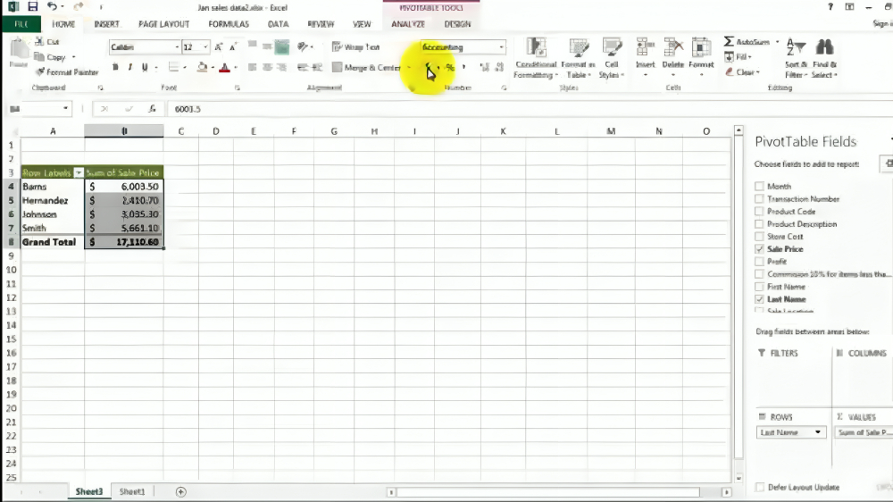

# Excel Essentials Revision  

## 1. Creating a Formula  
To create a formula:  
- Start by typing `=` in a cell.  
- Click on the cell you want to reference.  
- Add the desired operation (`+`, `-`, `*`, `/`) and repeat for additional references.  
Example: `=A1 + B1` adds the values in cells A1 and B1.  

---

## 2. What Does #### Mean?  
When you see `####` in a cell:  
- It indicates that the column width is too narrow to display the content.  
**Solution:** Adjust the column width by dragging the edge of the column header or double-clicking it to auto-fit.

---

## 3. Dragging to Select a Range of Columns  
To select a range of columns:  
- Click and hold the mouse button on the first column header.  
- Drag horizontally to the last column you want to select.  
This technique works similarly for rows or cells.

---

## 4. Relative and Absolute Referencing  
**Relative Referencing:** Changes when the formula is copied to another cell.  
Example: `=A1 + B1` copied to another row becomes `=A2 + B2`.  

**Absolute Referencing:** Stays fixed when copied, using `$` to lock rows or columns.  
Example: `$A$1` always refers to cell A1, regardless of where the formula is copied.  

**Error Use Case:**  
If you forget to use `$` in a formula like `=$A$1 * B1` for a table, copying the formula might miscalculate as all cells reference different values.

---

## 5. Keyboard Shortcuts in Excel  
- **ESC:** Cancels an entry or action without saving changes.  
- **F2:** Edit the active cell.  
- **Ctrl + Z:** Undo the last action.  
- **Ctrl + C/V:** Copy/Paste.  
- **Alt + =:** Auto-sum selected cells.  

---

## 6. Orientation from Ribbon  
You can adjust the text orientation by:  
1. Going to the **Home** tab on the Ribbon.  
2. Clicking on **Orientation** in the Alignment group.  
3. Choosing options like Rotate Text Up, Down, or Angled.  
This helps in better formatting of data in headers or columns.  

---

## 7. Formatting Data (Example: Converting a/b to %)  
To convert a fraction like `a/b` into a percentage:  
1. Select the cells containing the fraction.  
2. Go to the **Home** tab and choose the **Percentage Style** button in the Number group.  
3. Excel automatically converts the fraction to a percentage (e.g., `1/2` becomes `50%`).  

---

## 8. Conditional Formatting and Icons  
To apply conditional formatting with icons:  
1. Select the range of cells.  
2. Go to **Home > Conditional Formatting > Icon Sets**.  
3. Choose an icon set based on your conditions.  
4. Use **Manage Rules** to customize conditions like color changes for thresholds (e.g., green for >75, yellow for 50-75, red for <50).


---


## 9. Common Formulas  
- **IF:** `=IF(A1>10, "Yes", "No")` (Checks if A1 is greater than 10).  
- **SUMIF:** `=SUMIF(A1:A10, ">10", B1:B10)` (Sums values in B1:B10 where A1:A10 is greater than 10).  
- **OR:** `=OR(A1>10, B1<5)` (Returns TRUE if either condition is met).  
- **AVERAGE:** `=AVERAGE(A1:A10)` (Finds the average of a range).  
- **MIN/MAX:** `=MIN(A1:A10)` or `=MAX(A1:A10)` (Finds the minimum/maximum value in a range).  

---

## 10. Creating Charts and Adding Titles  
To create a chart:  
1. Select the data range.  
2. Go to **Insert > Charts** and choose a chart type.  
3. To add custom titles:  
   - Click on the chart, and go to **Chart Elements > Chart Title**.  
   - Type your title.  
4. For horizontal axis names:  
   - Select the chart, and choose **Axis Titles** under Chart Elements.  
   - Add the desired label for the axis.

## 11. Text Wrapping in Excel  

**Text Wrapping** adjusts cell content so that text fits within the cell by wrapping it into multiple lines. To enable it, select the cell(s), go to the **Home** tab, and click **Wrap Text** in the Alignment group. This ensures that long text stays visible without spilling into adjacent cells. Adjust row height if needed for better readability.
### How to Enable Text Wrapping  

1. **Select the cell(s):** Highlight the cell or range of cells where you want to apply text wrapping.  
2. **Go to Home Tab:** In the Ribbon, under the **Home** tab, locate the **Alignment** group.  
3. **Click Wrap Text:** Click on the **Wrap Text** button.  

## 12. What is a Pivot Table?  

A **Pivot Table** is a tool in Excel that helps summarize large datasets by creating a new table based on calculations like **sum**, **average**, **min**, **max**, etc. It allows you to quickly analyze and organize data for better understanding and insights.  

---

### Steps to Create a Pivot Table:  
1. **Select the Data Range:** Highlight the dataset you want to summarize.
   
   
   
2. **Go to Insert Tab:** Click on the **Insert** tab in the Ribbon and select **PivotTable**.
   
 
 
3. **Create the Pivot Table:** Choose where you want to place the Pivot Table (new or existing sheet), and configure the rows, columns, and values as needed.
   
   

4. **Manipulate Data and Adding Visuals:** Drag and drop fields into the **Rows**, **Columns**, and **Values** areas to customize your table. Apply filters or sort data to refine your analysis.
   
   
   
## 13. What is VLOOKUP?  

**VLOOKUP** (Vertical Lookup) is a powerful Excel function used to search for a value in the first column of a table and return a corresponding value from another column in the same row. It’s commonly used to fetch related data based on a key value.  


---


### Steps to create the VLOOKUP
1. Create values table.

   

2. Sort the values table.
    - Select DATA from Ribbon.
    -  Select Sort.
    -  Add creteria of sorting.

   

3. Write the fromula in the cell you want to refer for values

### Syntax  
```excel
=VLOOKUP(lookup_value, table_array, col_index_num, [range_lookup]
```

   


   #### VLOOKUP(lookup_value, table_array, col_index_num, [range_lookup] formula explanation
   
- **`lookup_value`**  
   - The value you want to search for in the first column of the table.  
   - Example: If you're searching for "John" in a list of names, "John" is the lookup_value.  
   - Can be a cell reference (e.g., `A1`) or a direct value (e.g., `"John"`).  

- **`table_array`**  
   - The range of cells containing the data, including both the lookup column and the column with the result you want to retrieve.  
   - Example: If your data is in columns A to D, your table_array could be `A1:D10`.  
   - The lookup_value is always searched in the **first column** of this range.  

- **`col_index_num`**  
   - The column number (relative to the table_array) from which you want to retrieve the value.  
   - Example: If the table_array is `A1:D10` and you want data from column C, the col_index_num is `3`.  
   - Must be a positive integer.  

- **`[range_lookup]`** (Optional)  
   - Determines whether to look for an **exact match** or an **approximate match**:  
     - `FALSE` (Exact Match): Returns a value only if it matches exactly.  
     - `TRUE` (Approximate Match): Returns the closest match (requires the first column of the table to be sorted in ascending order).  
   - Default: `TRUE` if omitted.  


